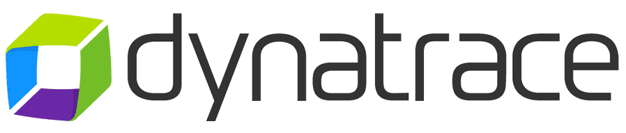

# Open Source jobs at Dynatrace

At Dynatrace we believe that actively contributing to the open-source community
is the basis for innovation and building better software together.
The company and its employees actively contribute to 
open-source projects, standards and foundations.
Click here to learn more: [open source at Dynatrace](https://engineering.dynatrace.com/open-source/).

This GitHub repository aggregates links to all open source focused jobs at Dynatrace.
If you are interested in all other job postings, go to the [Dynatrace careers portal](https://careers.dynatrace.com/).

## Jobs

### Open-source engineering jobs

- **Software Engineer (m/f/x) Open Standards and Integrations** - 
  [Vienna](https://careers.dynatrace.com/jobs/bb537bb8-fd46-43b9-ac88-f754b5a6177f/), 
  [Linz](https://careers.dynatrace.com/jobs/dc12ad24-3a5b-43de-839d-2b183ee37fa1/)
  - Build integrations that connect Dynatrace with different Open Source ecosystems 
  - Tech stack: Golang, Java, Kubernetes, Git/GitHub.
    Expertice with other languages is welcome
- [**Software engineer for Keptn open-source development (m/f/x)**](https://careers.dynatrace.com/jobs/96f35570-27e3-4bbc-b46f-d4c45ad54681/), Vienna
  - Join the teams working on [Keptn](https://keptn.sh/) - an event-driven cloud native app orchestration tool
  which is now a part of the Cloud-Native Computing Foundation (CNCF)
  - Work on the Keptn core and [integrations](https://keptn.sh/docs/integrations/) with different services
  - Tech stack: Golang, Java, Kubernetes, Git/GitHub
- [**Team lead for Keptn open-source development (m/f/x)**](https://careers.dynatrace.com/jobs/f18e53b7-cb93-4902-b5b4-cc0b958466ea/), Vienna
  - Lead a new team focusing on developing [integrations for Keptn](https://keptn.sh/docs/integrations/)
  - Contribute to shaping our open-source vision and contribution process, including testing, CI/CD, and maintenance

### Open Source Program Office jobs

- [**Technical Staff at OSPO (m/f/x)**](https://careers.dynatrace.com/jobs/7e3a0892-9fca-47c3-8083-8c4f3aa06616/), Linz
  - Work on open source programs together with the open source program manager and the rest of the team.
    It includes but not limited to documentation,
    GitHub org management and automation, 
    internal and public advocacy for best practices.
- [**Global Lead - Developer Relations @ Open Observability**](https://careers.dynatrace.com/jobs/00eeede2-0998-4442-b7a0-d986bf470af9/), any office or remote
  - Lead and facilitate developer relations in the open observability domain,
    with focus on combining open-source technologies with the Dynatrace platform
  - Work with open-source communities, foundations (esp. CNCF/CDF), customers, partners and end users
  - Examples: OpenTelemetry, CloudEvents, Prometheus, CD Events, etc.
- [**Global Lead - Developer Relations @ Open Security**](https://careers.dynatrace.com/jobs/0ffafd11-5b66-4194-bf0a-24c26bbe5642/), any office or remote
  - Lead and facilitate developer relations in the open security area,
    with focus on combining open source technologies with the Dynatrace platform
  - Work with FOSS communities, foundations (esp. CNCF/CDF/OpenSSF), customers, partners and end users
  - Examples: Open Policy Agent (OPA), Falco, SPDX, etc.

## FAQ

### Why Dynatrace?

* Great team and culture! We're a high-speed & high-tech company with flat hierarchy and open culture 
* Global Leader in Software Intelligence and Cloud Monitoring
* International and diverse workplace.
  Open-Door policy and collaborative environment.
* Open Source is a part of company's strategy.
  We encourage open-source contributions.
  All R&D newcomers get training on "contributing to open source" during onboarding.

Learn more about the [Dynatrace way of life](https://www.linkedin.com/company/dynatrace/life/4cadb4fe-56f9-4d8e-a50a-e3e0a3e87ea5/).

### Do you hire remotely?

The OSPO team is distributed and hires remotely.
And we are open to hiring remotely if the position allows for it. Please discuss it with the hiring manager. 

Find out more about hybrid work at Dynatrace on our dedicated [blog post](https://engineering.dynatrace.com/blog/what-is-the-future-of-work-at-dynatrace/) 

### Any other positions?

Dynatrace is growing, and we hire a lot of roles across the board.
There are other positions that are about being published soon.
So yes, we are potentially interested in many other roles!

We are working on a generic way to submit spontaneous applications.
Stay tuned!

### What about internships?

Dynatrace has an official [internship program for students in Austria](https://www.dynatrace.com/company/careers/austria/students/).
You can work, learn & grow in the Dynatrace galaxy while getting your degree.

Dynatrace also sponsors fully open-source mentorship and outreach programs
in projects it is involved in,
and provides its employees with working time for such mentorship programs.
For example, search for Keptn on [LFX Mentorship](https://mentorship.lfx.linuxfoundation.org/#projects_all).
See the [report by Ankit Jain](https://www.ankitjain28.me/communitybridge-mentee-with-keptn) who was one of mentees in the program.

### How to subscribe to new positions?

We intend to use GitHub releases for announcing new job postings in this repository.
Just subscirbe to the updates!

## Disclaimer

This repository is maintained by the Dynatrace Open Source Program Office (OSPO).
It should not be considered an official source of information,
some information may be outdated.
The official careers portal can be found [here](https://careers.dynatrace.com/).

## Contributing

See [CONTRIBUTING](./CONTRIBUTING.md).
All updates and issue reports will be appreciated!
